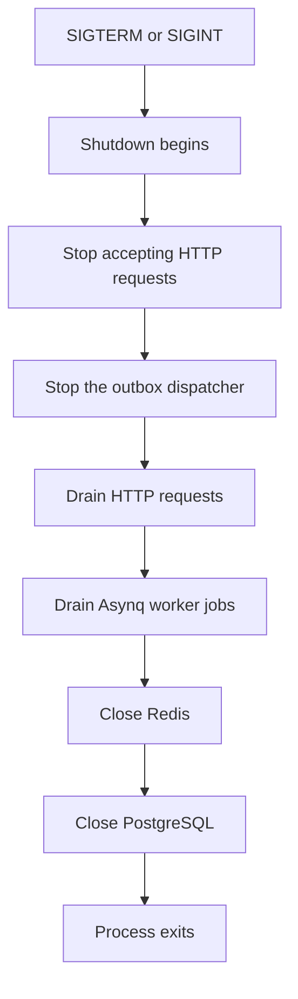

# Graceful shutdown

Blink handles `SIGINT` and `SIGTERM` in both the API and worker processes. The
shutdown deadline is configured with `SHUTDOWN_TIMEOUT`, which accepts a Go
duration such as `30s` and defaults to 30 seconds. Invalid or non-positive
values use the default.



## API

The API uses `http.Server.Shutdown` with the configured deadline. Existing
requests can finish during that period; the outbox dispatcher stops starting
new work and any current dispatch operation is canceled when shutdown begins.
After HTTP and dispatcher shutdown, the Asynq client is closed and then the
PostgreSQL pool is closed.

## Worker

The worker passes the configured deadline to Asynq's `Config.ShutdownTimeout`.
Asynq stops claiming new jobs, waits for active handlers during that window,
and then returns from `Shutdown`. Blink waits for the Asynq server goroutine to
return before closing the explicit retry client and PostgreSQL pool.

If the deadline expires during a handler, Blink does not mark that job as
successful. The existing Asynq recovery behavior and Blink's durable retry,
idempotency, reconciliation, and dead-letter transitions remain responsible
for recovering the job. An operation that reached a platform but whose result
is unknown continues through the existing `UNKNOWN` reconciliation path.

Startup failures return from `main` after the resources already created have
been closed. Shutdown is coordinated by one signal context; a second signal
cannot bypass the bounded cleanup path.

## Containers and local testing

The repository's Makefile starts the Go binaries directly, so signals reach
the Go process. Set a container stop grace period at least as long as
`SHUTDOWN_TIMEOUT` when deploying Blink. For a local smoke test:

```bash
SHUTDOWN_TIMEOUT=5s make run-api
SHUTDOWN_TIMEOUT=5s PLATFORM_MODE=mock make run-worker
```

Send `SIGTERM` or press Ctrl+C and inspect the structured shutdown events.
