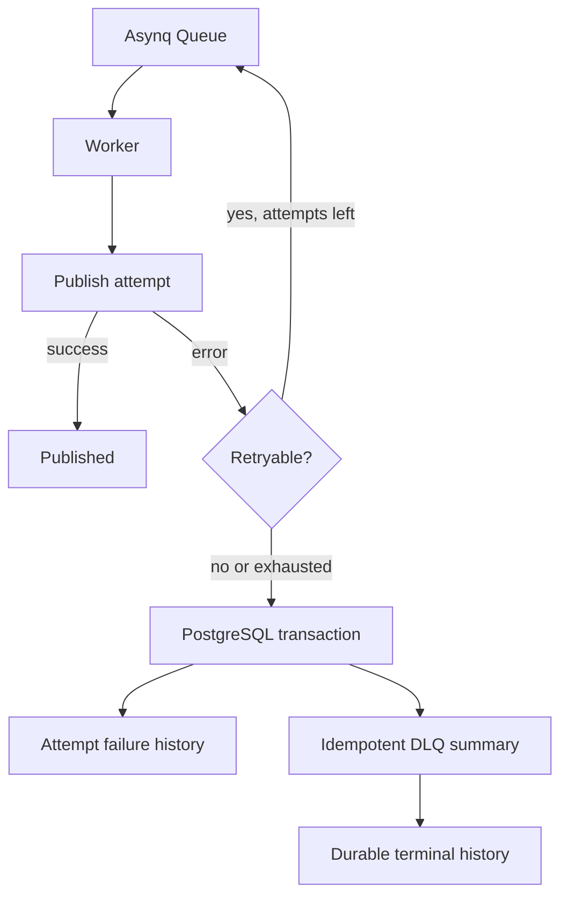

# Publication retries

Blink uses bounded retries with exponential backoff and platform reconciliation for ambiguous external operations.

An attempt is one delivery call claimed for a platform. `attempt_count` is zero before the first platform call and is incremented when that call begins. Blink permits three total delivery attempts, so the third failure is terminal and no fourth platform call is made.

Retryable failures use this asynchronous schedule:

- after attempt 1: 1 minute
- after attempt 2: 5 minutes

No calculated delay exceeds one hour. The maximum delay does not extend the three-attempt limit.

Connectors normalize platform responses into retryable, permanent, or ambiguous errors. Transient network/platform failures and HTTP 429/5xx responses are retryable. Validation, authorization, unsupported media, and other definitive 4xx failures are permanent. A timeout or lost response that may have reached the platform is ambiguous.

Ambiguous outcomes remain durable as `UNKNOWN` and go through the existing reconciliation path before another publish is considered. A found publication completes the original attempt; confirmed absence is the only reconciliation result that permits publishing again. An unresolved result is never blindly republished.

Retry state is persisted as `RETRYING` with `error_class` and `next_retry_at`. The same `publication_attempt_id` is used for every delivery. Asynq schedules the next execution with `ProcessIn`, while `MaxRetry(0)` prevents Asynq's native retry counter from multiplying Blink's business attempts. Workers do not sleep while waiting.

## Permanent failures and the database-backed DLQ

When a permanent connector error occurs, or a retryable error occurs on attempt
three, the worker records the terminal transition in PostgreSQL before it
returns. The transaction marks the `publication_attempts` row as `FAILED`,
marks the specific `post_targets` row as `FAILED`, records the failure in
`publication_attempt_failures`, and upserts one `dead_letter_jobs` summary for
that target. The target ID is the idempotency key because one Asynq task may
publish a post to several platforms.

The DLQ stores the post and target IDs, optional Asynq task ID, platform, actual
and configured attempt counts, failure type, redacted reason, safe structured
platform response, and first/last failure timestamps. Credentials and other
sensitive values are redacted before persistence. Individual failure rows retain
the history for each automatic attempt; the DLQ row is the final operator-facing
summary.

Asynq and Redis remain responsible for execution and retry scheduling, not
historical failure storage. The database write happens before the worker
considers a terminal failure handled, so the record remains after the Asynq
task disappears. If the write fails, the worker returns the error and logs
context rather than silently losing the failure.

Future manual retry tooling should inspect the DLQ row, resolve the underlying
problem, and start a new retry cycle with new attempt-history rows. It should
not silently reset or reuse the completed automatic attempt count.
